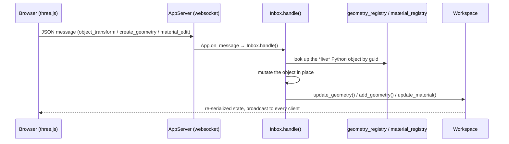
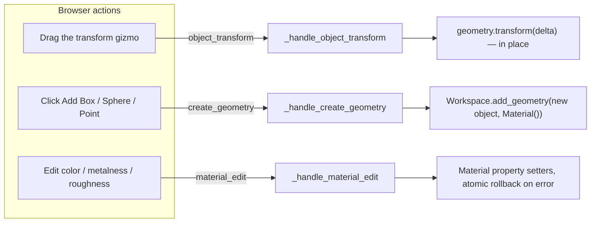

# Bidirectional sync — context for a future agent

## What this feature actually does

The viewer has two halves that used to talk in only one direction: a Python
**backend** builds and owns geometry (boxes, meshes, breps, whatever COMPAS
objects a script creates), and a browser-based three.js **frontend** displays
it. Before this work, information only flowed one way — the backend pushed
geometry and UI updates to the browser, and the only thing that ever came
back was UI plumbing like button clicks and object picks. If you dragged an
object in the browser, it moved on screen and nowhere else; the Python
object sitting in memory on the server never knew.

This feature closes the loop. Three specific actions performed in the
browser — **moving an object with the transform gizmo**, **adding a new
shape from the toolbar**, and **editing a material's color/metalness/
roughness** — now travel back to the backend as messages, get applied to the
*actual live Python object* the server is holding, and are then
re-broadcast to every connected browser so everyone's view stays in sync.

The key design idea worth internalizing before reading further: nothing is
replaced, only mutated. Each handler looks up the exact object instance
already living in the server's registry and edits it in place. That means
any other Python code holding a reference to that same object — a running
animation loop, a script's local variable — sees the change automatically,
with no extra notification mechanism required. It also means the backend
stays the single source of truth: the browser is proposing an edit, not
overwriting authoritative state.

See `CONTEXTE.md` in this same directory for the general module layout
(`App`/`Workspace`/`Inbox`/`Outbox`/`AppServer`/`Remote`) this builds on
top of. The paired frontend implementation lives in the sibling
`compas_threejs_ts` repo, at `src/viewer/BIDIRECTIONAL_SYNC.md` — read that
alongside this file for the full picture. Both repos carry this work on a
branch called `feature/bidirectional-sync`, branched off `main` in each.

## The round trip, at a glance



Every message is routed through `Inbox.handle()` → `Inbox._handlers`
(`inbox.py`) — the same dispatch table `ui_callback`/`object_picked`/etc.
already used. No new outbound message types were needed anywhere: once a
handler mutates the Python object, it hands off to an existing `Workspace`
method to re-serialize and broadcast, so the frontend receives the result
through the exact same `add_geometry`/`material` paths every script already
uses.

## The three message types



### `object_transform` — dragging the transform gizmo

Handler: `Inbox._handle_object_transform`. Payload: `{guid, matrix}` where
`matrix` is a **4x4 nested list, row-major**, and — this is the important,
non-obvious part — it is a **delta**, not an absolute placement. The
frontend computes it as `(matrix after drag) * (matrix before drag)^-1`.
Applying it via `compas.geometry.Transformation.from_matrix(matrix)` +
`geometry.transform(T)` works generically across every COMPAS
geometry/datastructure type (frame-based primitives, meshes, breps) with no
per-type special-casing, because `.transform()` is defined generically on
all of them.

**Why a delta and not an absolute matrix:** the frontend's mesh conversion
(`Object3D.applyMatrix4`, see the frontend doc) decomposes each object's
world frame directly into its `position`/`quaternion`/`scale`, so a
freshly-built `Object3D` already sits at its real placement, not identity.
Sending its post-drag matrix as if it were a delta (an early bug in this
feature) caused the backend to compose it *on top of* the object's current
state, landing it somewhere else entirely — looked like the object "jumped"
or "reverted." Fixed by having the frontend track the object's matrix as of
drag-start and diff against that.

Because the mutation is applied **in place** to the exact object instance
stored in `geometry_registry` — not a replacement — anything else
concurrently mutating that same Python object continues from the new state
automatically. This is what makes "drag a spinning torus to a new spot and
it keeps spinning from there" work: `examples/lights.py`'s `viz.loop`
callback holds the same `torus` reference the registry holds; nothing needs
to tell it "the object moved."

**Concurrency caveat (not fully solved):** `_handle_object_transform` runs
off the server's asyncio event loop via `asyncio.to_thread` (see
`server.py`'s `_websocket_endpoint`), i.e. on a thread-pool thread, while an
`App.loop` callback runs on the main thread. Both can mutate the same object
concurrently. `Inbox.lock` (a plain `threading.Lock`) guards only the
handler's own `geometry.transform()` call — it does **not** make arbitrary
user `loop` callbacks thread-safe. Given the default `loop_interval` (10ms)
and that dragging is a human-timescale event, real corruption is unlikely
but possible. If you're asked to harden this further, that's the seam.

Re-broadcast via `Workspace.update_geometry(geometry)` (existing method —
handles the Brep→viewmesh case too, so nothing new was needed there).

### `create_geometry` — "Add Box/Sphere/Point" from the toolbar

Handler: `Inbox._handle_create_geometry`. Payload: `{type, point: [x,y,z],
params: {...}}`. `type` is looked up in the module-level `_CREATABLE_TYPES`
registry (top of `inbox.py`), which maps a type name to its COMPAS
constructor and the whitelist of numeric kwargs a message is allowed to
set:

```python
_CREATABLE_TYPES = {
    "box": (Box, ("xsize", "ysize", "zsize")),
    "sphere": (Sphere, ("radius",)),
    "point": (Point, ()),
}
```

Frame-based shapes (everything except `point`) get a world-aligned `Frame`
built from `point` — orienting them is what the gizmo's rotate mode is for,
not this message. Missing params default to `1.0`. The constructed object
is handed off to `Workspace.add_geometry(geometry, Material())` — the
**same** method every example script calls, so registration, broadcast, and
replay-on-reconnect all come for free; the frontend needs zero
special-casing to render a frontend-created object.

**Extending the type set**: add an entry to `_CREATABLE_TYPES` and, if it
needs a frame, it'll pick up the same `Frame(Point(*point), [1,0,0],
[0,1,0])` construction automatically (see the `if type_name == "point": ...
else: ...` branch). Non-frame types (anything like `Point`) need their own
branch the way `point` has one.

**Deliberately deferred, not forgotten**: scale is not exposed via the
create UI or the gizmo for created (or any) objects — COMPAS shapes store
size as explicit dimensions (`box.xsize`, `sphere.radius`, ...) separate
from their frame, so a generic matrix-transform approach (like
`object_transform` uses) doesn't resize them correctly. A "click and drag in
3D space to draw a shape" placement UX was also explicitly scoped out in
favor of "spawn near camera, then drag into place with the existing gizmo"
— see the frontend doc for why that made this a small feature instead of a
large one.

### `material_edit` — toolbar color/metalness/roughness

Handler: `Inbox._handle_material_edit`. Payload: `{guid, color?, metalness?,
roughness?}` (`guid` is the **geometry's** guid, not a material guid — the
handler looks the material up via a new `Inbox.material_registry:
dict[geometry_guid, Material]`).

`material_registry` is populated automatically inside
`Workspace.add_geometry`, right where `material._geometry_guid` is already
set — so this covers every object added with a material by any script, and
`create_geometry` objects too, with one hook point and zero extra plumbing.

If a geometry was added with no material at all (`add_geometry(geometry)`,
no `material=` arg), `material_registry` has no entry for it — the handler
lazily creates a default `Material()` on first edit rather than failing.

**Validation is atomic on purpose.** `Material`'s property setters raise
`ValueError` on out-of-range values (metalness/roughness must be in `[0,
1]`). The handler builds a dict of pending updates, snapshots the current
values of only the fields being touched, and rolls back to that snapshot if
*any* field fails to apply — so a single bad value from a malformed message
can't leave the material half-updated while also skipping the broadcast
(which would silently desync the backend's true state from what's
rendered). This was found and fixed via a self-authored test during
implementation — worth keeping if this handler grows more fields.

**Scope is deliberately narrow**: only `compas_threejs.materials.Material`
("standard_material") objects are editable this way.
`PointMaterial`/`LineMaterial`/`PhysicalMaterial` have different property
sets entirely (e.g. a point's material has `size`, not
`metalness`/`roughness`) and aren't wired up — the frontend gates this
itself (see its doc) rather than the backend rejecting it.

**Why this reuses `Workspace.update_material` specifically**: it's the
exact method `examples/objects_action.py`'s "Make it blue"/"Make it red"
per-object action buttons already call on the same `Material` instance.
Because `material_registry` holds a reference to that *same* instance (not
a copy), a toolbar edit and a script-authored action button edit can't
drift out of sync — verified during implementation by editing a material
via the simulated `material_edit` path, then triggering the object's
existing "Make it blue" action and confirming it saw the toolbar edit's
changes.

## Wiring notes

- `Inbox.__init__` now takes an optional `app=None` back-reference
  (`App.__init__` passes `Inbox(self)`), needed so handlers can reach
  `self.app.get_workspace(workspace_id)` to call
  `update_geometry`/`add_geometry`/`update_material`. `Remote`'s own
  `Inbox()` in `remote.py` still uses the `app=None` default — `Remote`
  never routes inbound frontend messages today, so this is a no-op there,
  not a gap.
- No changes were needed in `Outbox`, `AppServer`, or the websocket
  plumbing — all three new handlers ride the existing inbound
  JSON-text-frame path (`AppServer._websocket_endpoint` → `App.on_message`
  → `Inbox.handle`) and existing outbound broadcast/persist machinery.

## Verifying changes here

No test suite exists in this repo (see `CONTEXTE.md`). Verification during
this work was ad hoc: start a real `App`, call
`app.inbox._handle_object_transform(...)` /
`_handle_create_geometry(...)` / `_handle_material_edit(...)` directly with
a hand-built message dict (exactly what `App.on_message` would decode), and
assert on the resulting Python object state directly. For end-to-end
confidence, also spin up a real `AppServer` and confirm the served
`frontend/assets/index.js` bundle actually contains the new dispatch string
names — the frontend build must be rebuilt and synced into
`src/compas_threejs/viewer/frontend/` (run `invoke sync-frontend` against a
local `compas_threejs_ts` checkout, or `invoke pre-build` for the pinned
release version; see `FRONTEND_WORKFLOW.md`) before any of this is
reachable from a real browser session.
